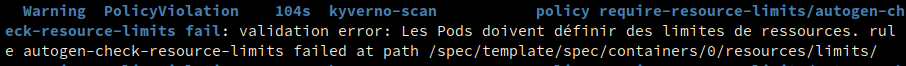

# App

The app is very simple it's a microservice made of a verb api a noun api and an aggregator returning a mix of the two.

## Kyverno

Kyverno is a policy engine designed for Kubernetes. It allows you to manage policies in a Kubernetes-native way. You can use Kyverno to validate, mutate, and generate configurations. Kyverno policies are Kubernetes resources, which means you can manage them using kubectl, GitOps tools, or any other Kubernetes-native tooling.

### Installation

```bash
helm repo add kyverno https://kyverno.github.io/kyverno/
helm repo update

helm install kyverno kyverno/kyverno --namespace kyverno --create-namespace
```

### Admission policies

The admission policies are a way to enforce policies on the cluster. For example, you can enforce that all pods have a specific label, or that all pods have a specific annotation. You can also enforce that all pods have a specific resource request or limit.

#### pod-resource-limit

This policy enforces that all pods have a resource limit set. If a pod does not have a resource limit set, the policy will reject the pod.

```yaml
apiVersion: kyverno.io/v1
kind: ClusterPolicy
metadata:
  name: require-resource-limits
spec:
  validationFailureAction: enforce
  rules:
  - name: check-resource-limits
    match:
      resources:
        kinds:
        - Pod
    validate:
      message: "Les Pods doivent définir des limites de ressources."
      pattern:
        spec:
          containers:
          - resources:
              limits:
                memory: "?*"
                cpu: "?*"
```

Here is what you see in the deployment logs when the policy is applied:




### Mutation policies

Mutation policies are a way to modify resources before they are created. For example, you can use a mutation policy to add a label to all pods in a specific namespace, or to add an annotation to all pods with a specific label.

available here [default resources limits](./kyverno/mutation-add-default-ressources.yaml) and [root readonly pods](./kyverno/mutation-add-readonly.yaml)