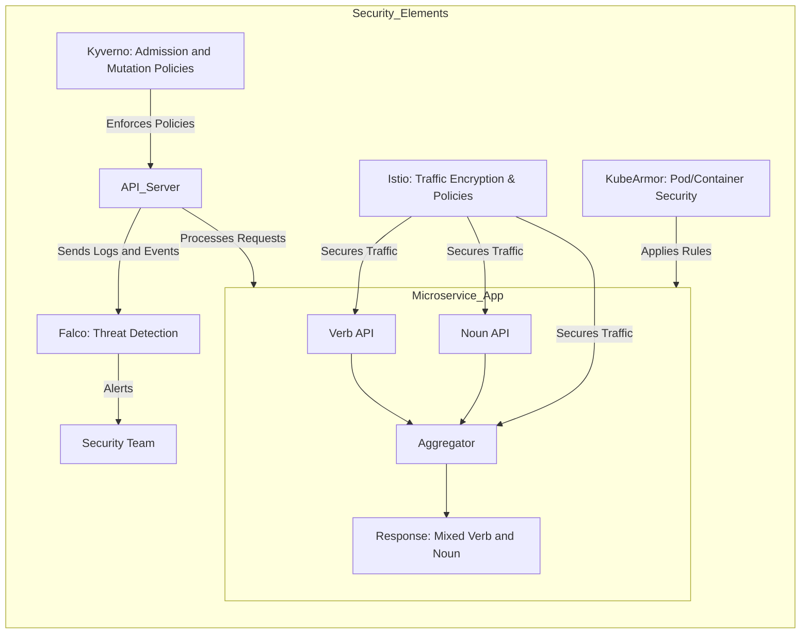
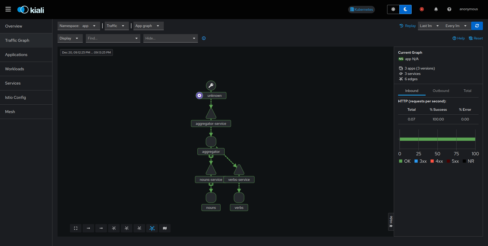
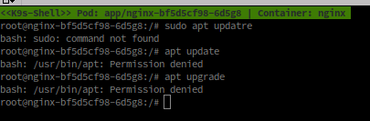
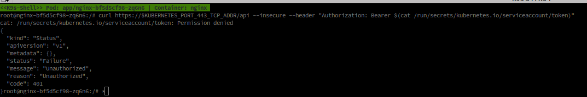
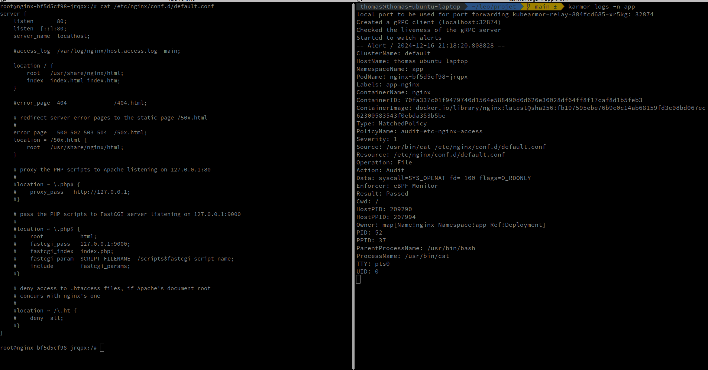

# App

The app is very simple it's a microservice made of a verb api a noun api and an aggregator returning a mix of the two.




## Quick install

Using the ./full-install.sh script you can install all the components in one go.

```bash
chmod +x full-install.sh
./full-install.sh
```

> Make sure you have istioctl and helm installed.

This version doesn't install the kubearmor component as it seems to overlap with the other components.

## Kyverno

Kyverno is a policy engine designed for Kubernetes. It allows you to manage policies in a Kubernetes-native way. You can use Kyverno to validate, mutate, and generate configurations. Kyverno policies are Kubernetes resources, which means you can manage them using kubectl, GitOps tools, or any other Kubernetes-native tooling.

### Installation

```bash
helm repo add kyverno https://kyverno.github.io/kyverno/
helm repo update

helm install kyverno kyverno/kyverno --namespace kyverno --create-namespace
```

### Admission policies

The admission policies are a way to enforce policies on the cluster. For example, you can enforce that all pods have a specific label, or that all pods have a specific annotation. You can also enforce that all pods have a specific resource request or limit.

#### pod-resource-limit

This policy enforces that all pods have a resource limit set. If a pod does not have a resource limit set, the policy will reject the pod.

```yaml
apiVersion: kyverno.io/v1
kind: ClusterPolicy
metadata:
  name: require-resource-limits
spec:
  validationFailureAction: enforce
  rules:
  - name: check-resource-limits
    match:
      resources:
        kinds:
        - Pod
    validate:
      message: "Les Pods doivent définir des limites de ressources."
      pattern:
        spec:
          containers:
          - resources:
              limits:
                memory: "?*"
                cpu: "?*"
```

Here is what you see in the deployment logs when the policy is applied:


### Mutation policies

Mutation policies are a way to modify resources before they are created. For example, you can use a mutation policy to add a label to all pods in a specific namespace, or to add an annotation to all pods with a specific label.

available here [default resources limits](./kyverno/mutation-add-default-ressources.yaml) and [root readonly pods](./kyverno/mutation-add-readonly.yaml)


### Test the policies

First delete the mutation policies 


```bash
kubectl delete clusterpolicy default-resource-limits
kubectl delete clusterpolicy enforce-read-only-root-filesystem
```

Then try to apply bad resources

```bash
kubectl apply -f ./kyverno/tests
```
We see that our resources are not created because they don't respect the policies.

```bash
kubectl apply -f ./kyverno/
```

Now that we added the mutation policies we can see that we can apply our resources.

```bash
kubectl apply -f ./kyverno/tests/test-readonly.yaml
kubectl apply -f ./kyverno/tests/test-resources.yaml
```

```bash
## Falco

Falco is a runtime security tool that detects unexpected behavior in your applications. It can detect things like shell activity, file access, network activity, and more. Falco uses a set of rules to detect these behaviors, and you can write your own rules to detect custom behaviors.

### Installation

https://falco.org/docs/getting-started/falco-kubernetes-quickstart/


```bash
helm repo add falcosecurity https://falcosecurity.github.io/charts
helm repo update

helm install falco falcosecurity/falco \
  --namespace falco \
  --create-namespace \
  --set falco.jsonOutput=true \
  --set falco.logLevel=info \
  --set ebpf.enabled=true \
  --set auditLog.enabled=true
```

To make it work with kyverno I had to exclude the falco namespace from the kyverno policies.

```yaml
    exclude:
      resources:
        namespaces:
        - falco
        selector:
          matchLabels:
            app.kubernetes.io/name: falco
```

### Playing with falco

By checking the logs of the falco pod you can see the rules being loaded.

#### Check the rules

```bash
kubectl get configmap -n falco falco -o yaml
```

#### WebUI

the web ui is easy to install following this tutorial: https://falco.org/docs/getting-started/falco-kubernetes-quickstart/

## Istio

Istio is a service mesh that provides traffic encryption, traffic management, and security policies. 
You can use Istio to encrypt traffic between services, to manage traffic between services, and to enforce security policies on your services.

[documentation](https://istio.io/latest/docs/setup/getting-started/)

### Installation

```bash
curl -L https://istio.io/downloadIstio | sh -
cd istio-1.24.1
export PATH=$PWD/bin:$PATH
```

```bash
istioctl install -f istio/demo-profile-no-gateways.yaml  -y
``` 

We are going to add a label to our namespace to instruct Istio to automatically inject the envoy sidecar.

Envoy is a proxy that is injected into your pods by Istio. It intercepts all incoming and outgoing traffic from your pods, and it enforces the traffic policies that you define in Istio.

```bash
kubectl label namespace app istio-injection=enabled
```

We also need to install the gateway api crd

```bash
kubectl get crd gateways.gateway.networking.k8s.io &> /dev/null || \
{ kubectl kustomize "github.com/kubernetes-sigs/gateway-api/config/crd?ref=v1.2.0" | kubectl apply -f -; }
```

#### Traffic encryption

We can enable mutual TLS between the services by enabling the `STRICT` mode.

```yaml
apiVersion: security.istio.io/v1beta1
kind: PeerAuthentication
metadata:
  name: default
  namespace: app
spec:
  mtls:
    mode: STRICT
    
```

### Kiali

Kilia is a tool that helps you visualize the traffic in your Istio service mesh. It provides a graphical interface that shows you the traffic between your services, and it allows you to drill down into the details of the traffic.

```bash
kubectl apply -f https://raw.githubusercontent.com/istio/istio/release-1.24/samples/addons/kiali.yaml

kubectl apply -f https://raw.githubusercontent.com/istio/istio/release-1.24/samples/addons/prometheus.yaml --namespace istio-system

kubectl apply -f ./istio/
```



We can see in this schema that our services speak using a secured connexion, we 
can ensure that by connecting to a pod and running tcpdump.

output
```bash
20:20:24.887602 IP istiod.istio-system.svc.cluster.local.15012 > aggregator-deployment-764dcfd487-4pq7d.36532: Flags [P.], seq 1246457591:1246457630, ack 3702643983, win 7000, options [nop,nop,TS val 1401211848 ecr 1888747397], length 39
20:20:24.887645 IP aggregator-deployment-764dcfd487-4pq7d.36532 > istiod.istio-system.svc.cluster.local.15012: Flags [.], ack 39, win 3819, options [nop,nop,TS val 1888761969 ecr 1401211848], length 0
20:20:24.887767 IP aggregator-deployment-764dcfd487-4pq7d.36532 > istiod.istio-system.svc.cluster.local.15012: Flags [P.], seq 1:40, ack 39, win 3819, options [nop,nop,TS val 1888761969 ecr 1401211848], length 39
20:20:24.888700 IP aggregator-deployment-764dcfd487-4pq7d.50674 > kube-dns.kube-system.svc.cluster.local.domain: 36229+ PTR? 2.219.43.10.in-addr.arpa. (42)
20:20:24.889227 IP kube-dns.kube-system.svc.cluster.local.domain > aggregator-deployment-764dcfd487-4pq7d.50674: 36229*- 1/0/0 PTR istiod.istio-system.svc.cluster.local. (117)
20:20:24.889581 IP aggregator-deployment-764dcfd487-4pq7d.57126 > kube-dns.kube-system.svc.cluster.local.domain: 20993+ PTR? 10.0.43.10.in-addr.arpa. (41)
20:20:24.890049 IP kube-dns.kube-system.svc.cluster.local.domain > aggregator-deployment-764dcfd487-4pq7d.57126: 20993*- 1/0/0 PTR kube-dns.kube-system.svc.cluster.local. (116)
20:20:24.929828 IP istiod.istio-system.svc.cluster.local.15012 > aggregator-deployment-764dcfd487-4pq7d.36532: Flags [.], ack 40, win 7000, options [nop,nop,TS val 1401211891 ecr 1888761969], length 0
20:20:25.154690 IP 10.42.0.1.34116 > aggregator-deployment-764dcfd487-4pq7d.15021: Flags [S], seq 2882518896, win 64860, options [mss 1410,sackOK,TS val 2885481094 ecr 0,nop,wscale 7], length 0
20:20:25.154770 IP aggregator-deployment-764dcfd487-4pq7d.15021 > 10.42.0.1.34116: Flags [S.], seq 2318760215, ack 2882518897, win 64308, options [mss 1410,sackOK,TS val 1899494745 ecr 2885481094,nop,wscale 7], length 0
20:20:25.154871 IP 10.42.0.1.34116 > aggregator-deployment-764dcfd487-4pq7d.15021: Flags [.], ack 1, win 507, options [nop,nop,TS val 2885481095 ecr 1899494745], length 0
20:20:25.155118 IP aggregator-deployment-764dcfd487-4pq7d.43241 > kube-dns.kube-system.svc.cluster.local.domain: 13876+ PTR? 1.0.42.10.in-addr.arpa. (40)
```


The logs showing traffic between the sidecar proxy (localhost.15020) and Istio control plane (istiod.istio-system.svc.cluster.local.15012), along with istioctl proxy-config verification, confirm that mTLS is enabled and securing communication.


## Kubearmor

I also tried kubearmor but it seems like the overlap with other component make it a bit hard to maintain

Kubearmor is a runtime security tool that enforces security policies on your Kubernetes cluster. It can enforce policies like preventing containers from running as root, preventing containers from running with dangerous capabilities, and preventing containers from running with dangerous volumes.

### Installation

```bash
helm repo add kubearmor https://kubearmor.github.io/charts
helm repo update kubearmor
helm upgrade --install kubearmor-operator kubearmor/kubearmor-operator -n kubearmor --create-namespace
kubectl apply -f https://raw.githubusercontent.com/kubearmor/KubeArmor/main/pkg/KubeArmorOperator/config/samples/sample-config.yml
```

We can also install the kubearmor cli
```bash
curl -sfL http://get.kubearmor.io/ | sudo sh -s -- -b /usr/local/bin
```

### Playing with kubearmor

**Avoid apt**

We can create a policy to prevent containers from running apt commands

```yaml
apiVersion: security.kubearmor.com/v1
kind: KubeArmorPolicy
metadata:
  name: block-pkg-mgmt-tools-exec
  namespace: app # important to specify
spec:
  selector:
    matchLabels:
      app: nginx
  process:
    matchPaths:
    - path: /usr/bin/apt
    - path: /usr/bin/apt-get
  action:
    Block
```



**Block the service access-token access**

We can create a policy to prevent containers from accessing the service account token. This is a very sensitive token that should not be accessed by the application.

```yaml
apiVersion: security.kubearmor.com/v1
kind: KubeArmorPolicy
metadata:
  name: block-service-access-token-access
  namespace: app
spec:
  selector:
    matchLabels:
      app: nginx
  file:
    matchDirectories:
    - dir: /run/secrets/kubernetes.io/serviceaccount/
      recursive: true
  action:
    Block
  ```



**Audit access to a file**

We first need to anotate the namespace to allow audit

```bash
kubectl annotate ns app kubearmor-visibility="process,file,network" --overwrite
```

```yaml
apiVersion: security.kubearmor.com/v1
kind: KubeArmorPolicy
metadata:
  name: audit-etc-nginx-access
  namespace: app
spec:
  selector:
    matchLabels:
      app: nginx
  file:
    matchDirectories:
    - dir: /etc/nginx/
      recursive: true  
  action:
    Audit
```

Here we can see the log of the audit on the right after I cat a file in the /etc/nginx directory.


